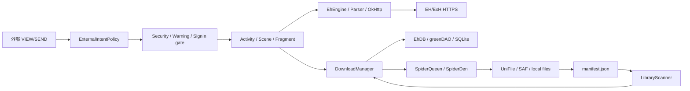

# Ehview 架构与核心数据流

## 范围

本文描述当前原生 Android 仓库的实际边界，不把历史产品设想当作已实现能力。工程包含两个 Gradle 模块：

| 模块 | 职责 | 主要风险 |
| --- | --- | --- |
| `app` | Android UI、网络、解析、下载、阅读、本地库、SQLite、原生图片/归档能力 | 状态与 I/O 高度集中，存在静态服务定位与主线程耦合 |
| `daogenerator` | greenDAO 实体与 DAO 代码生成 | schema 变化会影响 app 的迁移和兼容性 |

## 主要边界

| 边界 | 入口 | 核心实现 | 持久化/外部依赖 |
| --- | --- | --- | --- |
| 应用启动 | `EhApplication` | `Settings`、`EhDB`、`EhEngine`、`Native` 初始化 | SharedPreferences、SQLite、native `.so` |
| 导航与门禁 | `SplashActivity`、`MainActivity`、`ExternalIntentActivity` | Scene/Announcer 路由、Security/Warning/SignIn gate | 外部 Intent、通知 PendingIntent |
| 在线数据 | Scene/Activity | `EhEngine`、parser、OkHttp、WebView bridge | EH/ExH HTTPS 服务、Cookie |
| 下载与阅读 | `DownloadService`、Scene | `DownloadManager`、`SpiderQueen`、`SpiderDen` | greenDAO、UniFile/SAF、图片文件 |
| 本地库恢复 | 设置页 | `LibraryScanner`、`LibraryManifest`、`DownloadManager.syncLocalLibrary` | 作品目录、manifest、SQLite |
| 归档 | 下载/导出入口 | `GZIPUtils`、A7Zip、`LibraryExporter` | 不可信 ZIP/归档、SAF 目标 |
| Wi-Fi 迁移 | legacy Activity | `ConnectThread`、WiFi Activity | 明文旧协议；当前入口禁用 |

## 核心数据流

下载索引同时存在于 `DownloadManager` 的全量列表、gid map、标签 bucket、标签计数和数据库中。任何 mutation 必须保持这些视图一致；测试不应只断言 UI 结果，还应断言所有索引不变量。

## 安全信任边界

- 外部 Intent 只进入导出的 `ExternalIntentActivity`；内部 `MainActivity` 不导出，Scene class 不能由外部 extras 指定。
- 带身份 Cookie 的 WebView 只允许精确官方 HTTPS host，拒绝 userinfo、IP literal、非 443、file/content/data 和 mixed content。网络 bridge 对 DNS 与 redirect 再校验。
- FileProvider 路径必须满足目录组件边界，不能仅依赖字符串前缀。
- ZIP 解压先预检再写入，限制条目数、单条目、总展开量和压缩比，并使用独立 staging。
- 旧 Wi-Fi 协议没有机密性和对端认证，因此当前 Activity 在 manifest 中禁用；framing 修复不等于加密协议修复。
- Gradle 构件由校验元数据固定；GitHub Actions 固定到完整 commit SHA。

## 隐藏耦合与维护风险

| 风险 | 证据 | 影响 | 推荐演进 |
| --- | --- | --- | --- |
| 全局静态服务定位 | `EhApplication`、`Settings`、`EhDB` | 测试隔离困难，初始化顺序成为隐式 API | 先引入 app-scoped facade，再逐步注入 DB/network/storage |
| 下载协调器职责过多 | `DownloadManager` 同时维护索引、队列、DB、文件、listener | 并发与回滚困难，局部修改易破坏其他视图 | 拆为 repository、queue、index、UI event 四层；先固定不变量测试 |
| 本地库同步混合线程职责 | `DownloadFragment.LocalLibraryScanTask` + `DownloadManager.syncLocalLibrary` | scan 在后台，但 DB/manifest/listener 仍集中于主线程 | 建立 immutable sync plan、后台事务、主线程一次性提交与通知 |
| 启动迁移缺 readiness barrier | `EhApplication.onCreate -> EhDB.mergeOldDB` | 大旧库会拉长冷启动；直接异步又会产生抢读 | 增加 migration coordinator 和明确的 ready state，再移出主线程 |
| WebView 实现重复 | 登录、资料、UConfig、MyTags 各自维护 client | 安全策略可能漂移 | 收敛到共享 authenticated WebView factory/policy |
| Java/Kotlin/native 混合且历史依赖多 | `app/src/main/cpp`、JitPack 依赖 | 升级、fuzz 和 ABI 验证成本高 | 建 native harness、SBOM/升级节奏、逐组件替换陈旧依赖 |

## 变更不变量

1. 不得从“清理无效下载”路径删除用户作品文件；该入口只能审计和报告。
2. 未完成安全门禁前，任何外部 Intent 都不能进入目标 Scene。
3. 所有归档输出路径必须位于 staging 根目录内，失败必须清理部分输出。
4. manifest 替换必须保留旧版本直到新版本完成写入，并能从 backup/temp 恢复。
5. 下载 gid map、全量列表、标签列表和标签计数必须同步更新。
6. 依赖或 GitHub Action 更新必须伴随 checksum/SHA 审阅。

## 当前明确未完成

- 旧 Wi-Fi 迁移需要经过密码学评审的新协议，不应重新启用旧入口。
- native 图片/归档解析器缺少针对 App JNI 边界的 fuzz harness。
- 首次方行/分支覆盖率与 changed-line gate 尚未建立；当前 CI 只验证测试执行与结果。
- 真实账号、验证码、UConfig、MyTags 和动态归档节点需要人工设备验收。
