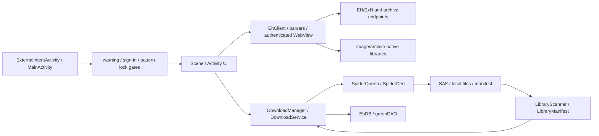

# Ehview 深度工程审计与修复最终报告

## 执行摘要

- 审计基线：`72ae3beb8ab76b707c611e8895f5d40fb1bff3e6`
- 工作分支：`codex/audit-remediation-20260710`
- 取证/对比基线：`codex/backup-audit-pre-fix-20260710`（包含已修风险，不可直接部署）
- 范围：架构、安全、测试、性能、代码质量、文档、供应链与 CI。
- 结论：本地可安全修复项已按风险域落地并复核；判定为 `partial-pass`，不是生产安全认证。
- 自动化：242 JVM/Robolectric；API 23 为 8 个执行通过、2 个按 SDK 预期跳过；API 35 为 10/10；debug/release lint 0 error；strict verification + strict locking 构建与设备路径通过。

## 架构审计

### 模块边界与核心数据流

| 边界 | 当前职责 | 审计结论 |
| --- | --- | --- |
| `ui` / Scene / Activity | 路由、gate、展示、任务触发 | 入口已收敛，但 Scene 仍直接触碰 DB、网络、文件和静态 Settings，修改半径大 |
| `client` / parser / WebView | HTTP、Cookie、解析、认证页面 | policy 已集中一部分；native WebView、bridge 和页面兼容仍是不同保障级别 |
| `download` / `spider` | 队列、索引、下载、页面存储 | DownloadManager 仍兼具 repository/index/queue/event 职责，并与 EhDB 双向耦合 |
| `library` | manifest、扫描、恢复、同步 | 文件扫描已可恢复；sync plan、DB 事务与 UI 通知仍未分层 |
| `EhDB` / DAO | 持久化与 legacy migration | 事务性已补；仍导入 UI 常量并依赖 DownloadManager，形成方向倒置 |
| `cpp` / native libs | 图片和归档解析 | 缺 App 调用边界 fuzz/sanitizer，风险不能由 JVM 测试替代 |

### 隐藏耦合与可维护性风险

- `EhDB ↔ DownloadManager` 双向依赖；`download/client` 还直接引用 `MainActivity`、Scene 或 Announcer，核心层依赖 UI。
- `Settings`、`EhDB` 与 manager 大量静态全局状态让测试隔离、并发和初始化顺序脆弱。
- 大类证据：`GalleryListScene` 约 2,279 行、`GalleryDetailScene` 约 2,271 行、`DownloadsScene` 约 2,032 行、`DownloadManager` 约 1,687 行、`Settings` 约 1,542 行、`EhDB` 约 1,281 行。
- AsyncTask、旧 Android API 和静态 listener 仍存在；直接“移到后台”会把现有对象 mutation 变成竞态，需先建立 immutable plan/commit 边界。

## 优先级定义

- P0：可能造成数据不可逆删除、鉴权/gate 绕过、凭据接管、任意文件写入或明文迁移暴露。
- P1：可能造成安全边界漂移、数据不一致、主线程卡顿、供应链不可复现或高风险路径失测。
- P2：维护成本、性能余量、文档与长期治理问题。

## P0 问题

| ID / 状态 | 文件路径 | 原因 | 影响 | 修复建议 / 实际处理 | 验证方式 |
| --- | --- | --- | --- | --- | --- |
| P0-01 已修复 | `DownloadFragment.java`、`InvalidDownloadScanner.java`、`LibraryImageFilePolicy.java` | “清理无效下载”把校验和删除混在一起，且未知 SAF 长度、零字节页和不可用根目录语义不清 | 合法图库或 DB 状态可能被不可逆破坏 | 改为零删除只读审计；区分非空/空/不可读；只报告 issue | `InvalidDownloadScannerTest`、`LibraryImageFilePolicyTest`；重复扫描文件不变 |
| P0-02 已修复 | Manifest、`ExternalIntentActivity.java`、`ExternalIntentPolicy.java`、`MainActivity.java`、`StageActivity.java` | 导出 Main、外部 extras/Scene class 与 gate 顺序形成绕过面 | 第三方 App 可尝试在锁、警告或登录前进入内部 Scene | Main 非导出；VIEW/SEND 走最小 allowlist；剥离 extras；Scene 类型约束；目标统一包在 gate 后 | 外部 intent、Scene、gate JVM/Robolectric；真实设备入口 smoke 仍待办 |
| P0-03 本地已修、外部待办 | parser fixtures、`TestFixtureSecretPolicyTest`、secret scanner | fixture 曾包含捕获的可复用 API 身份 | 旧 Git 历史、fork、缓存或服务端 session 仍可被滥用 | 当前树改合成值并加 scanner；维护者必须吊销/轮换并处置远端历史 | 当前树与 scanner 自测；外部以服务端审计和全历史扫描验收 |
| P0-04 解压核心已修；下载/提交残余为 P1 | `GZIPUtils.java`、`ArchiverDownloadDialog.java` | 直接落盘 ZIP 缺 containment、配额、可信快照和失败提交策略 | Zip Slip、磁盘耗尽、伪图片、半图库 | 已做路径/条目/单项/总量/压缩比限制、私有有界快照、图片签名+尺寸、staging 与 best-effort 全列表回滚 | `GZIPUtilsTest`、`ArchiverDownloadPolicyTest`；跨域 redirect、下载前配额、SAF no-replace/强原子仍未关闭 |
| P0-05 已缓解，功能关闭 | Manifest、advanced settings、Wi-Fi Activities、`ConnectThread.java` | 旧 Wi-Fi 迁移明文且无可靠对端认证，同时 TCP framing 不完整 | 同网段窃听/篡改、错帧、敏感日志 | 修复 framing 与日志，但不宣称加密；Activity disabled/non-exported，入口删除 | framing 与 security gate 测试；新协议评审前不得恢复 |

## P1 问题

| ID / 状态 | 文件路径 | 原因 | 影响 | 修复建议 / 实际处理 | 验证方式 |
| --- | --- | --- | --- | --- | --- |
| P1-01 部分完成 | `TrustedWebRequestPolicy.java`、`PublicAddressPolicy.java`、登录/Profile/UConfig/MyTags WebView | Cookie WebView 的导航、子资源、redirect、DNS 与本地 scheme 策略曾分散；native WebView 不保证所有 302/Service Worker 请求经过 bridge 策略 | SSRF、相似域、私网解析或 Cookie 上下文恶意内容 | 精确 HTTPS/443 host；拒绝 userinfo/IP；bridge 做公网 DNS 与每跳校验；禁 file/content/mixed | policy/settings 单测；仍需 native 302、Service Worker 和真实账号 instrumentation |
| P1-02 已修复 | `FileProvider.java` | canonical path 使用字符串 prefix | `/root_evil` 同前缀兄弟目录可能越界 | 改为 root 相等或 `root + separator` 的组件边界 | `FileProviderPathStrategyTest` sibling/traversal/round-trip |
| P1-03 已修复本地展示 | `IdentityCookiePreference.java`、`scene_cookie_sign_in.xml` | 设置对话框与手工登录字段曾暴露可复用 Cookie，允许 copy/autofill/state save | 旁观、剪贴板、自动填充或实例状态造成会话接管 | 设置只显示登录状态；移除复制；输入字段密码遮罩、禁 autofill/保存 | `IdentityCookiePreferenceTest`、`CookieSignInLayoutSecurityTest`；防截图不是本轮边界 |
| P1-04 已修复核心路径 | `DownloadNotificationIntentFactory.java`、`DownloadService.kt` | service PendingIntent 缺 immutable flag；Activity token 仅 extras 不同却复用 requestCode | Android 12+ 异常，或通知目标互相覆盖 | 统一 immutable+update-current；下载中/已完成 requestCode 分离 | `DownloadNotificationIntentFactoryTest`；真实通知设备 smoke 仍待办 |
| P1-05 已修复核心路径 | `DownloadManager.java` | gid map、all list、label bucket、count 在不同 mutation 独立维护 | UI/DB/内存不一致、计数错误、导入丢项 | 集中同步、补全 all list、缺标签时创建、每 bucket 一次排序 | `DownloadManagerInvariantTest`；随机并发状态机仍待补 |
| P1-06 已修复核心故障 | `LibraryManifest.java`、`LibraryScanner.java` | manifest 原地写、重复 checkpoint、扫描盲信 finish | 崩溃后损坏、写放大、缺图仍显示完成 | temp/backup 替换、单写者、同内容合并、fallback、完成状态基于磁盘证据 | manifest recovery/coalescing/corrupt primary/stale finish tests |
| P1-07 新格式已修；旧 CSV 残余 | `DownloadCsvParser.java`、`DownloadFragment.java`、`GalleryInfo.java` | 旧 CSV 无转义；整文件读入且无上界；首版 JSONL schema 又遗漏持久化 nullable/unknown 字段 | OOM/ANR、合法逗号/换行/多标签无法恢复、备份自不兼容 | strict UTF-8 流式 parser；16 MiB/64 Ki/10k；新导出使用强制版本头 `.jsonl`；精确 Integer/Long；允许持久化的 pages=0/title/thumb null | `DownloadCsvParserTest`、`DownloadCsvParserDeviceTest`；API 23/35 |
| P1-08 已修复一致性，线程残余 | `EhDB.java`、`EhApplication.java` | legacy migration 逐行写、吞错、无持久 pending；测试曾未真正重放 | 部分迁移、不可重试、重复 QuickSearch、冷启动卡顿 | 完整读取后单事务 batch；pending；稳定 legacy ID；真实 commit-marker replay | `EhDBLegacyMigrationTest`；大旧库启动基准待补 |
| P1-09 已修复本地门禁 | `build.gradle`、`app/gradle.lockfile`、`daogenerator/gradle.lockfile`、workflows、verification metadata、secret scanner | 缺严格锁；Actions 指向 annotated tag object；平台构件 hash 和敏感文件规则不全 | 依赖漂移、tag 被替换、跨平台 CI/设备路径失败、密钥回归 | `LockMode.STRICT`；debug/release/connected UTP/DAO runtime 锁；peeled commit SHA；三平台 AAPT2 hash；564/997 checksum | 无 `--write-locks` strict debug/release/device/DAO；scanner self-test；官方 Gradle locking/verification 规则 |
| P1-10 未完成 | `DownloadFragment.LocalLibraryScanTask`、`DownloadManager.syncLocalLibrary` | scan 虽在后台，DB 查询/写、manifest、索引 mutation 与 listener 仍耦合主线程 | 大库恢复掉帧/ANR；直接异步会引入竞态 | 建 immutable `SyncPlan`；后台单事务+checkpoint；主线程一次 index commit/notify | 100/1k/10k、慢 provider、StrictMode/FrameMetrics、事务失败注入 |
| P1-11 未完成 | `.github/workflows/build.yml`、测试目录 | CI 原“coverage”实际只数 test case | 生产代码可能未执行仍显示绿色 | 已改名 execution gate；下一步采集 first-party line/branch，设 changed-line ratchet 和 mutation gate | 覆盖率 XML/HTML；删除安全判断必须令测试失败 |
| P1-12 未完成 | `MainActivity.saveImageToTempFile()` | 第三方 `content://` 图片在入口线程解码，无字节、时间、真实类型和像素上限 | 慢/恶意 provider 可阻塞入口、耗内存或触发解码器风险 | 后台有界快照；magic+dimension；超时/取消；只在验证后交给 UI | 慢 provider、无限流、超大像素、错误 MIME instrumentation |
| P1-13 未完成 | `app/src/main/cpp`、archive/image JNI 入口 | 无 App 调用边界 fuzz/sanitizer harness | 畸形图片/归档可能触发 OOB、整数溢出或崩溃 | libFuzzer corpus、ASan/UBSan、上游版本/CVE SLA | corpus regression、sanitizer CI、崩溃最小化 |

## P2 问题

| ID / 状态 | 文件路径 | 原因 | 影响 | 修复建议 / 实际处理 | 验证方式 |
| --- | --- | --- | --- | --- | --- |
| P2-01 已优化 | `EhDB.java` QuickSearch | incoming 对 existing 嵌套扫描 | `O(E×I)` 导入慢 | HashSet + batch，`O(E+I)` | `EhDBQuickSearchTest` |
| P2-02 已优化 | `WiFiServerActivity.java` | 循环 `remove(0)` | ArrayList 下 `O(n²)` | index cursor，`O(n)` | 等价测试/编译；功能仍禁用 |
| P2-03 已优化 | `InvalidDownloadScanner.java` | list/find/二次遍历同一 SAF 目录 | provider 往返与重复计算 | 单 snapshot；未知长度仅一字节 probe | scanner/policy tests |
| P2-04 未完成 | `DownloadManager.java`、`EhDB.java`、Scenes、`Settings.java` | 超大类、多职责、静态状态、核心层依赖 UI | 修改半径大、并发与测试隔离差、安全 policy 漂移 | 先拆 repository/index/queue/event、migration coordinator、authenticated WebView factory；禁止一次性重写 | 依赖方向测试、API contracts、类/函数复杂度 ratchet |
| P2-05 部分完成 | 全仓 lint/Gradle | 仍有 920 warnings、AsyncTask/旧 API、Gradle 10 弃用提示 | 升级阻力与信号噪声 | 本轮 lint 未增长且较基线减少 2；按 ID 建 warning budget | 每 PR 不增长；Gradle 10 兼容 lane |
| P2-06 已完成本轮文档 | `README.md`、`docs/architecture.md`、`development.md`、`deployment.md`、`troubleshooting.md` | 原 README/开发/部署/排障说明不足 | 新维护者无法稳定复现与接手 | 已新增事实型文档、命令、部署和故障手册；旧 handoff 后续归档 | 链接/variant/CI 对照与独立复核 |
| P2-07 部分完成 | archive/import/scanner | SAF 多文件 rename 无跨文件事务；existing-check 到 rename 有竞态；极端像素尺寸仍可能昂贵 | 并发同名写、删除失败时只能 best-effort rollback | 按 gid 串行提交；支持 no-replace move 的后端优先使用；记录 committed set；增加像素预算 | 并发故障注入、真实 DocumentsProvider、多进程 stress |

## 安全专项结论

- 鉴权/授权：本地展示、WebView 注入边界和外部导航 gate 已加固；服务端 session 失效无法本地证明。
- 输入校验：Intent、JSONL/legacy CSV、ZIP、FileProvider、WebView URL/DNS 和 Wi-Fi frame 已有显式 policy 与负向测试。
- SQL 注入：动态查询使用参数绑定或固定内部表名；未发现不可信输入控制 SQL 结构的路径。
- 命令注入：发现的 `Runtime.exec("logcat -d")` 是固定命令，无用户拼接；未发现可利用命令注入。
- XSS/SSRF：无暴露的 `addJavascriptInterface`；bridge 路径已逐跳/公网校验，native WebView 和 DownloadManager redirect 仍需专门 instrumentation。
- 敏感信息：当前提交树 scanner 通过，但不等于 Git 历史清理、服务端吊销或 APK 二进制扫描。

## 性能审计结论

- 已落地：QuickSearch `O(E×I)→O(E+I)`、Wi-Fi 分页 `O(n²)→O(n)`、标签 bucket 批量排序、scanner 单快照、manifest 相同内容合并。
- 本轮静态复核未确认独立 lazy-load ORM N+1；已确认 LocalLibrary sync 的逐记录 DB/manifest/index 操作构成应用级 N+1/主线程慢路径，仍需运行时 query trace 定量。
- 大文件路径已为 JSONL/ZIP 增加字节、行、记录、条目和实际写出配额；外部图片 provider 与下载阶段仍缺预读取预算。
- 缓存残余：认证 WebView policy/DNS、library metadata 与 DB readiness 还没有明确缓存失效和观测指标。

## 测试补齐计划

### P0/P1

1. 对 ExternalIntent/gate、ZIP、WebView、FileProvider 做 mutation testing。
2. 增加 native WebView 302 私网跳转、Service Worker、第三方资源与真实账号设备测试。
3. DownloadManager 做 property/state-machine test；随机 add/move/delete/import/sync 后校验所有索引。
4. LocalLibrary 增加 100/1,000/10,000 作品、慢 SAF、rename/delete 失败、进程中断与事务失败。
5. 外部图片 provider 增加无限流、慢流、错误 MIME、超大像素和取消测试。
6. 建历史 secret scan/服务端 rotation 证据与 native sanitizer 最小门禁。

### P2

1. 建 first-party 行/分支覆盖率基线与 changed-line ratchet；242 是 test count，不是 coverage。
2. 建 lint warning、AsyncTask、依赖方向与复杂函数预算。
3. 旧 CSV 保持只读兼容 corpus；新写入只使用版本化 JSONL。

## 文档审计与交付

- `README.md`：补充项目入口、构建、测试和维护文档导航。
- `docs/architecture.md`：模块、数据流、线程与边界说明。
- `docs/development.md`：JDK/SDK、variant、strict verification/locking、测试命令。
- `docs/deployment.md`：release 构建、签名边界、发布前检查与回滚。
- `docs/troubleshooting.md`：Gradle、资源污染、模拟器、SAF、登录与下载故障排查。
- `docs/codex/*`：执行、逐项变更、验证证据与会话索引，供其他审计者复验。

## 回滚与发布判定

- `codex/backup-audit-pre-fix-20260710` / `72ae3beb...` 是任务前取证基线，会恢复真实 fixture 与明文 Wi-Fi 风险，不可作为安全可部署版本。
- 行为回滚应按同一风险域的依赖链逆序 `git revert`，随后重跑完整门禁；单独 revert 一个跨提交修复不保证可构建或安全。不要使用 `reset --hard` 或 `git clean`。
- 不得通过回滚恢复真实 fixture 凭据或重新启用明文 Wi-Fi。
- 当前适合维护者代码审查和真实设备验收，不应直接发布。发布前至少完成：服务端凭据处置、真实账号 WebView/下载/SAF smoke、native 风险接受或最小 fuzz 门禁、release 签名与回滚演练。
