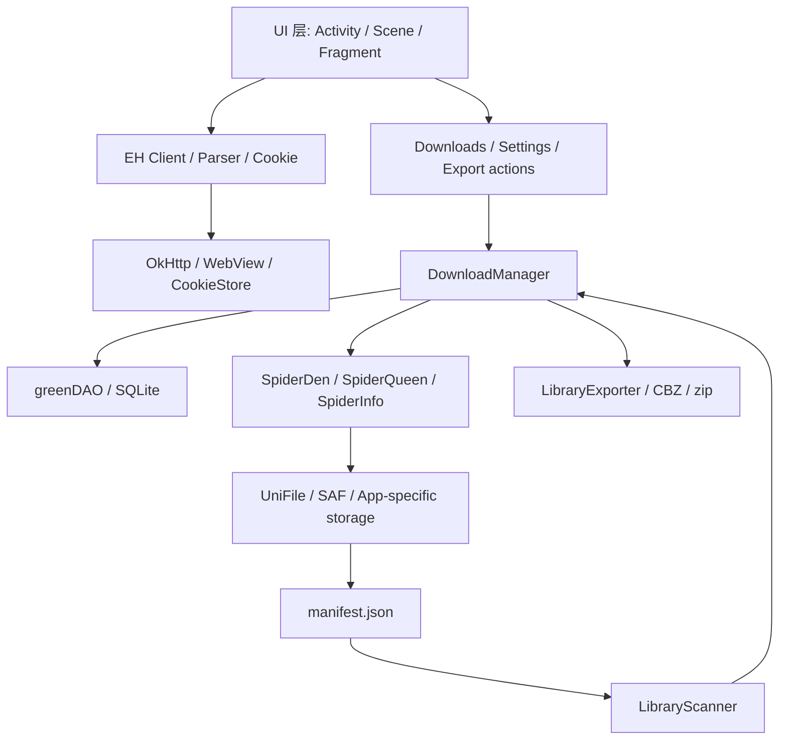

# Ehview 原生 Android Fork 维护者接手手册

生成日期：2026-05-31  
目标读者：第一次接触本项目、需要接手维护和继续开发的 Android 工程师  
仓库路径：`/Users/eric/Documents/Ehview`  
当前主工作分支：`codex/handoff-native-port`  
当前 PR：`https://github.com/rtwsvj/Ehviewer_CN_SXJ/pull/1`  
上游基线：`xiaojieonly/Ehviewer_CN_SXJ` 的 `BiLi_PC_Gamer` 分支  
Eric fork：`rtwsvj/Ehviewer_CN_SXJ`

## 1. 一句话说明

这是一个基于 `Ehviewer_CN_SXJ` 的原生 Android fork。项目目标不是重写一个新客户端，而是在成熟 EhViewer Android 客户端上，逐步增强安全性、可维护性、本地库、离线阅读和导出能力。

当前阶段已经完成了 fork、基础安全加固、复杂度优化和第一阶段“本地库闭环”。它能构建 debug APK，也经过了 Android 15 模拟器基础烟测，但还没有完成真实账号、真实下载作品、真实 SAF 授权目录和真实导出的完整人工验收。

## 2. 你接手前必须知道的前因后果

### 2.1 最早的产品想法

Eric 最初有一个独立项目 handoff，路径是：

```text
/Users/eric/Downloads/探索/eh-viewer/HANDOFF.md
```

那个项目当时的设想是：

- Tauri Android + Rust core + Web UI。
- 支持 Android，未来可能扩展到 macOS、Windows、iOS。
- 登录方式为粘贴 Cookie。
- Cookie 存进系统安全存储。
- 用户选择本地库路径。
- SQLite 建本地索引。
- 作品文件以“目录 + manifest”管理。
- 支持下载优先阅读、边读边缓存。
- 当前阅读优先于后台下载。
- 离线模式只读本地库。
- 支持 CBZ 和全库/选中库 zip 导出。

这些是产品目标，不再是技术栈约束。

### 2.2 为什么改为原生 Android fork

在评估后，项目技术路线从 Tauri/Rust 切到原生 Android fork，原因很直接：

- 上游 `Ehviewer_CN_SXJ` 已经有成熟 EH/ExH 浏览、登录、下载、阅读、SQLite、SAF/UniFile 和 Android UI。
- 如果从 Tauri/Rust 重写，工程量会集中在网络、登录、下载器、阅读器、权限和 Android 兼容性上，风险更高。
- 当前目标更像“在已有 Android 客户端上做安全、离线、本地库和导出增强”，不是验证跨平台 UI 技术。

因此，本仓库以 `xiaojieonly/Ehviewer_CN_SXJ` 的 `BiLi_PC_Gamer` 分支为基线，fork 到 Eric 的 GitHub 账号 `rtwsvj`。

### 2.3 重要边界

当前阶段明确不做：

- 不迁移 Tauri/Rust 原型代码。
- 不改包名、应用名、图标和品牌。
- 不新增数据库 schema。
- 不迁移 `targetSdkVersion`。
- 不做大规模依赖升级。
- 不重构主 UI 导航。
- 不把当前 PR 直接提给 upstream；先在 Eric fork 内部审核。

这些边界是为了把风险控制在“安全加固 + 本地库第一阶段 + 性能热路径优化”范围内。

## 3. 当前仓库状态

### 3.1 Remotes

```text
origin   https://github.com/rtwsvj/Ehviewer_CN_SXJ.git
upstream https://github.com/xiaojieonly/Ehviewer_CN_SXJ.git
```

### 3.2 分支与 PR

```text
current branch: codex/handoff-native-port
base branch:    BiLi_PC_Gamer
draft PR:       https://github.com/rtwsvj/Ehviewer_CN_SXJ/pull/1
latest HEAD:    43e95dad66b975049cbacdfb0694b75f9a45c3a4
```

PR 标题：

```text
[codex] Implement native local library closed loop
```

PR 目前是 draft，因为还需要真实账号、真实 SAF、真实下载作品和真实导出的工程师验收。

### 3.3 本地未跟踪内容

当前本地工作区有两个未跟踪内容：

```text
artifacts/
docs/project-engineering-report-2026-05-30.md
```

说明：

- `artifacts/` 是模拟器手测证据目录，包含截图、UI XML、抽出的测试 DB，不建议提交。
- `docs/project-engineering-report-2026-05-30.md` 是阶段性工程报告草稿，可视审核需要决定是否提交。
- 本文件 `docs/engineer-onboarding-maintenance-guide.md` 生成后也会先处于未提交状态，除非 Eric 要求提交。

## 4. 到目前为止的提交链

| 顺序 | Commit | 标题 | 说明 |
| --- | --- | --- | --- |
| 1 | `56ca124` | `Implement native handoff foundations` | 建立原生 Android fork 工作基础，接入 handoff 产品方向 |
| 2 | `061b6d3` | `Add selected library export actions` | 增加选中作品、本地库导出相关入口与任务骨架 |
| 3 | `64e1a4c` | `Harden Android security surfaces` | 安全热修复，覆盖 TLS、权限、Cookie、FileProvider、归档入口、SQL 等 |
| 4 | `a942400` | `Resolve release lint errors` | 修复 release lint 阻塞项 |
| 5 | `00253d1` | `Add Android CI security gate` | 增加 GitHub Actions 安全检查门禁 |
| 6 | `80c804a` | `Fix JVM test Conscrypt runtime` | 修复 JVM/Robolectric 测试 Conscrypt runtime |
| 7 | `f00594f` | `Optimize Android complexity hot paths` | 优化标签建议、过滤、导入、批量下载操作、搜索和目录索引 |
| 8 | `74c32b3` | `Implement local library closed loop` | 实现 manifest、scanner、sync、导出刷新和设置入口 |
| 9 | `43e95da` | `Document local library manual testing` | 补工程文档、手测记录，并修复 scanner tag 重复写入 |

相对上游基线，当前 PR 大约包含：

```text
64 files changed, 3528 insertions(+), 475 deletions(-)
```

## 5. 产品目标

### 5.1 长期目标

把当前 EH 在线浏览器升级成：

- 在线获取：继续使用现有 EH/ExH 浏览、详情页、下载队列和阅读器。
- 本地库优先：用户选择的下载目录就是可信本地库根目录。
- 可离线：无网络或离线模式下，可以浏览本地索引、阅读已下载作品。
- 可迁移：每个作品目录都有 manifest，脱离数据库后仍能重建索引。
- 可导出：支持单作品 CBZ、选中作品 CBZ、整库 zip，导出包含图片和 manifest。

### 5.2 第一阶段目标

第一阶段目标是“本地库闭环”：

```text
用户选择下载目录
  -> 下载或放入作品目录
  -> 作品目录生成/携带 manifest.json
  -> 扫描本地库根目录
  -> 同步到 Downloads 数据库和列表
  -> 离线/导出/后续重建都能复用这些元数据
```

当前第一阶段已经有基础实现，但还需要真实数据验收。

## 6. 项目技术栈

### 6.1 Android 与构建

- 原生 Android 项目。
- Gradle 9.3.1。
- Android Gradle Plugin 9.1.1。
- JDK 21。
- Kotlin 和 Java 混合，但新增核心本地库代码主要是 Java。
- native C/C++ 依赖仍沿用上游，例如 libjpeg-turbo、7zip 相关能力。

### 6.2 数据与存储

- greenDAO / SQLite：存下载、历史、搜索、标签等现有数据。
- UniFile：统一 SAF、file URI 和 Android 存储访问。
- SpiderDen / SpiderInfo：现有下载目录和页信息体系。
- `manifest.json`：本 fork 新增的本地库长期标准元数据。
- Android Keystore：用于身份 Cookie 的安全存储辅助层。

### 6.3 网络与登录

- EH/ExH 网络能力沿用上游。
- Cookie 登录沿用现有 UI，但敏感 Cookie 现在进入安全存储。
- WebView 登录仍保留，但 file scheme cookie 接受能力已关闭。
- Release 网络安全配置不再信任用户 CA，不再允许 trust-all fallback。

## 7. 架构总览



读代码时可以按这条线理解：

- UI 触发设置、下载、导出和重建索引。
- `DownloadManager` 是下载列表和本地库同步的核心协调者。
- `SpiderDen` 管目录，`SpiderQueen` 管下载/阅读页缓存。
- `LibraryManifest` 定义作品目录的长期元数据。
- `LibraryScanner` 把磁盘目录恢复成数据库下载项。
- `LibraryExporter` 把已下载作品导出为 CBZ/zip。

## 8. 关键目录与文件

### 8.1 项目入口

| 文件 | 说明 |
| --- | --- |
| `settings.gradle` | Gradle 工程入口 |
| `app/build.gradle` | Android app 构建配置 |
| `app/src/main/AndroidManifest.xml` | Android manifest、权限、Activity/exported 配置 |
| `.github/workflows/build.yml` | GitHub Actions 构建与安全门禁 |
| `.github/workflows/fastlane.yml` | Fastlane 相关 CI |

### 8.2 应用初始化

| 文件 | 说明 |
| --- | --- |
| `app/src/main/java/com/hippo/ehviewer/EhApplication.java` | app 全局初始化，网络、数据库、下载管理等 |
| `app/src/main/java/com/hippo/ehviewer/Settings.java` | 设置项，包含离线模式、本地库路径等 |
| `app/src/main/java/com/hippo/ehviewer/EhDB.java` | SQLite/greenDAO 辅助层 |

### 8.3 登录、Cookie、安全存储

| 文件 | 说明 |
| --- | --- |
| `app/src/main/java/com/hippo/ehviewer/client/EhCookieStore.java` | Cookie 读写、恢复、注入 |
| `app/src/main/java/com/hippo/ehviewer/client/SecureCookieStorage.java` | Android Keystore 支持的敏感 Cookie 存储 |
| `app/src/main/java/com/hippo/ehviewer/ui/scene/sign/CookieSignInScene.java` | 手动粘贴 Cookie 登录 UI |
| `app/src/main/java/com/hippo/ehviewer/ui/scene/sign/WebViewSignInScene.kt` | WebView 登录 |

### 8.4 网络、安全与归档

| 文件 | 说明 |
| --- | --- |
| `app/src/main/res/xml/network_security_config.xml` | debug/release 网络 CA 策略 |
| `app/src/main/res/xml/filepaths.xml` | FileProvider 暴露范围 |
| `app/src/main/java/com/hippo/ehviewer/gallery/ArchiveSecurity.java` | 归档导入/读取安全限制 |
| `app/src/main/java/com/hippo/ehviewer/gallery/A7ZipArchive.java` | 7zip 归档读取 |
| `app/src/main/java/com/hippo/ehviewer/gallery/ArchiveGalleryProvider.java` | 归档 gallery provider |

### 8.5 本地库核心

| 文件 | 说明 |
| --- | --- |
| `app/src/main/java/com/hippo/ehviewer/library/LibraryManifest.java` | `manifest.json` 读写与容错 |
| `app/src/main/java/com/hippo/ehviewer/library/LibraryScanner.java` | 扫描本地库根目录，重建下载索引 |
| `app/src/main/java/com/hippo/ehviewer/library/LibraryExporter.java` | CBZ/zip 导出 |
| `app/src/main/java/com/hippo/ehviewer/download/DownloadManager.java` | 下载列表、本地库 sync、批量操作 |
| `app/src/main/java/com/hippo/ehviewer/spider/SpiderDen.java` | 下载目录定位和目录索引 |
| `app/src/main/java/com/hippo/ehviewer/spider/SpiderQueen.java` | 下载、阅读页缓存、离线页处理 |

### 8.6 UI 入口

| 文件 | 说明 |
| --- | --- |
| `app/src/main/java/com/hippo/ehviewer/ui/MainActivity.java` | 主 Activity |
| `app/src/main/java/com/hippo/ehviewer/ui/fragment/DownloadFragment.java` | 下载设置页，包含重建索引和导出入口 |
| `app/src/main/java/com/hippo/ehviewer/ui/scene/download/DownloadsScene.java` | Downloads 页面 |
| `app/src/main/java/com/hippo/ehviewer/ui/LibraryExportTask.java` | 导出任务的 UI/AsyncTask 包装 |
| `app/src/main/res/xml/download_settings.xml` | 下载设置项 XML |

### 8.7 性能优化相关

| 文件 | 说明 |
| --- | --- |
| `app/src/main/java/com/hippo/ehviewer/client/EhTagDatabase.java` | 标签建议索引 |
| `app/src/main/java/com/hippo/ehviewer/widget/SearchBar.java` | 输入防抖 |
| `app/src/main/java/com/hippo/ehviewer/client/EhFilter.java` | gallery filter 索引 |
| `app/src/main/java/com/hippo/ehviewer/sync/DownloadListInfosExecutor.java` | 下载列表搜索与批量 tag 查询 |

### 8.8 测试

| 文件 | 说明 |
| --- | --- |
| `app/src/test/java/com/hippo/ehviewer/EhDBSecurityTest.java` | DB 安全查询测试 |
| `app/src/test/java/com/hippo/ehviewer/client/EhCookieStoreTest.java` | Cookie 安全标志和存储测试 |
| `app/src/test/java/com/hippo/ehviewer/client/EhFilterTest.java` | filter 语义与优化测试 |
| `app/src/test/java/com/hippo/ehviewer/client/EhTagDatabaseTest.java` | tag suggest 测试 |
| `app/src/test/java/com/hippo/ehviewer/gallery/ArchiveSecurityTest.java` | 归档安全限制测试 |
| `app/src/test/java/com/hippo/ehviewer/library/LibraryManifestTest.java` | manifest roundtrip 和容错测试 |
| `app/src/test/java/com/hippo/ehviewer/library/LibraryScannerTest.java` | scanner + sync + 幂等 + tag 去重测试 |
| `app/src/test/java/com/hippo/ehviewer/library/LibraryExporterTest.java` | 导出文件名和导出行为测试 |

## 9. 本地库数据模型

### 9.1 目录结构

目标结构：

```text
<local-library-root>/
  <gid>-<token-or-title>/
    00000001.jpg
    00000002.jpg
    ...
    manifest.json
    .ehviewer
```

说明：

- `manifest.json` 是新标准。
- `.ehviewer` 是旧 EhViewer/SpiderInfo 元数据，作为兼容导入来源。
- scanner 当前只扫描 root 的一级作品目录，不递归扫描任意深层目录。

### 9.2 Manifest schema

当前 schema：

```text
ehview.library.manifest.v1
```

典型内容：

```json
{
  "schema": "ehview.library.manifest.v1",
  "generatedAt": 1770000000000,
  "source": {
    "type": "ehentai",
    "gid": 123456,
    "token": "manualtoken",
    "galleryUrl": "https://e-hentai.org/g/123456/manualtoken/"
  },
  "gallery": {
    "gid": 123456,
    "token": "manualtoken",
    "title": "Manual Local Library Test",
    "titleJpn": "手动本地库测试",
    "uploader": "codex",
    "pages": 1,
    "simpleLanguage": "EN",
    "simpleTags": ["female:manual"],
    "tgList": ["female:manual", "artist:codex"]
  },
  "download": {
    "state": 3,
    "time": 1770000000000,
    "label": null
  },
  "reading": {
    "startPage": 0,
    "pages": 1
  },
  "files": [
    {
      "name": "00000001.jpg",
      "size": 3,
      "lastModified": 1770000000000
    }
  ]
}
```

### 9.3 Scanner 同步规则

`LibraryScanner.scan(root)` 负责读磁盘，`DownloadManager.syncLocalLibrary(result)` 负责写数据库和刷新内存列表。

规则：

- root 不可读：`failed++`，不中断 app。
- 非目录：忽略。
- 目录没有 manifest 且没有 `.ehviewer`：`skipped++`。
- manifest 损坏：记录 warning，当前目录失败或跳过，不影响其他目录。
- `gid <= 0` 或缺 token：失败。
- 完成状态：manifest/download 已完成，或本地图片数量大于等于页数。
- 新作品：插入 Downloads。
- 已有作品：合并元数据，但保留用户 label/time。
- 活动下载状态 `STATE_WAIT` / `STATE_DOWNLOAD` 不被扫描覆盖。
- tags 从 `tgList` 和 `simpleTags` 重建，并去重。
- 同步后刷新 manifest，使本地目录靠拢当前 v1 schema。

## 10. 离线模式

离线模式设置项：

```text
Settings.KEY_OFFLINE_MODE = "offline_mode"
```

UI 位于：

```text
app/src/main/res/xml/download_settings.xml
```

相关行为：

- `EhClient` 在离线模式下阻止 EH 网络请求，返回本地模式错误。
- `SpiderQueen` 在离线模式下缺页时给出本地不可用错误。
- Downloads / 本地库列表仍应可用。
- 已下载作品应可阅读。
- 缺失图片页不能联网补页。

工程师复测时要特别验证：开启离线模式后，在线列表/详情不应继续打 EH 网络，但已下载作品仍能打开。

## 11. 导出能力

当前导出类型：

- 单作品 CBZ。
- 已下载作品批量 CBZ。
- 本地库 zip。

入口：

- 下载设置页。
- Downloads 页面相关 action。

核心实现：

- `LibraryExportTask`
- `LibraryExporter`

导出规则：

- 导出前刷新 manifest。
- CBZ 包含图片和 `manifest.json`。
- 整库 zip 结构为 `galleries/<作品目录>/...`。
- 批量导出复用 `SpiderDen.DownloadDirIndex`，避免重复扫描下载根目录。

## 12. 安全加固说明

### 12.1 TLS

Release 不再信任用户 CA，只信任系统 CA。Debug 可以使用 user CA override，便于本地抓包调试。

删除了 trust-all fallback。TLS 初始化失败时不应自动降级为不校验证书。

### 12.2 Android 权限

已收敛高风险权限和行为：

- 不再主动请求 Android 11+ All Files Access。
- 不依赖 `MANAGE_EXTERNAL_STORAGE` 作为本地库方案。
- 本地库应走 SAF 授权目录或 app-specific 目录。
- `REQUEST_INSTALL_PACKAGES` 等非必要高风险权限已处理。

### 12.3 Cookie

身份 Cookie 包括：

- `ipb_member_id`
- `ipb_pass_hash`
- `igneous`

处理原则：

- 存储层进入 `SecureCookieStorage`。
- 注入 Cookie 时强制 `Secure + HttpOnly + Path=/`。
- 登出时清理安全存储。
- 不接受 file scheme cookies。

### 12.4 外部文件入口

当前策略：

- 收窄 GalleryActivity/归档外部入口。
- 保留应用内部显式打开归档能力。
- 归档导入前做大小、条目数、可读性检查。
- FileProvider 不再暴露 `<root-path>`。

## 13. 性能优化说明

本阶段重点处理了高频热路径：

- 标签建议：索引化，减少全量扫描。
- 搜索输入：增加防抖。
- Gallery filter：HashSet 索引替代重复嵌套扫描。
- 数据库导入：key set 去重，减少重复 query。
- 下载批量操作：gid set + 单遍扫描，减少 `contains()` / `remove()` 重复扫描。
- 下载搜索：批量读取缺失 `GalleryTags`，减少 N+1。
- 目录定位：`SpiderDen.DownloadDirIndex` 避免每个作品都扫 root。
- 导出：批量复用目录索引。

工程师继续优化时，要优先保持语义不变，尤其是搜索结果、下载列表顺序、用户 label 和数据库去重规则。

## 14. 构建与测试

### 14.1 环境要求

建议环境：

```text
JDK 21
Android SDK / platform-tools
Android command-line tools
NDK / CMake
Gradle wrapper from repo
```

本机已使用过的路径：

```text
JAVA_HOME=/opt/homebrew/opt/openjdk@21
ANDROID_HOME=/opt/homebrew/share/android-commandlinetools
ANDROID_SDK_ROOT=/opt/homebrew/share/android-commandlinetools
```

### 14.2 命令约定

Eric 的本地规则要求 shell 命令使用 `rtk` 前缀。

示例：

```bash
rtk git status -sb
rtk env JAVA_HOME=/opt/homebrew/opt/openjdk@21 ANDROID_HOME=/opt/homebrew/share/android-commandlinetools ANDROID_SDK_ROOT=/opt/homebrew/share/android-commandlinetools ./gradlew --no-daemon --max-workers=2 app:assembleDebug --stacktrace
```

### 14.3 常用构建命令

构建 debug APK：

```bash
rtk env JAVA_HOME=/opt/homebrew/opt/openjdk@21 ANDROID_HOME=/opt/homebrew/share/android-commandlinetools ANDROID_SDK_ROOT=/opt/homebrew/share/android-commandlinetools ./gradlew --no-daemon --max-workers=2 app:assembleDebug --stacktrace
```

完整回归：

```bash
rtk env JAVA_HOME=/opt/homebrew/opt/openjdk@21 ANDROID_HOME=/opt/homebrew/share/android-commandlinetools ANDROID_SDK_ROOT=/opt/homebrew/share/android-commandlinetools ./gradlew --no-daemon --max-workers=2 app:testAppReleaseDebugUnitTest app:lintAppReleaseDebug app:assembleDebug --stacktrace
```

本地库 focused tests：

```bash
rtk env JAVA_HOME=/opt/homebrew/opt/openjdk@21 ANDROID_HOME=/opt/homebrew/share/android-commandlinetools ANDROID_SDK_ROOT=/opt/homebrew/share/android-commandlinetools ./gradlew --no-daemon --max-workers=2 app:testAppReleaseDebugUnitTest --tests com.hippo.ehviewer.library.LibraryManifestTest --tests com.hippo.ehviewer.library.LibraryScannerTest --tests com.hippo.ehviewer.library.LibraryExporterTest --stacktrace
```

安全相关 focused tests：

```bash
rtk env JAVA_HOME=/opt/homebrew/opt/openjdk@21 ANDROID_HOME=/opt/homebrew/share/android-commandlinetools ANDROID_SDK_ROOT=/opt/homebrew/share/android-commandlinetools ./gradlew --no-daemon --max-workers=2 app:testAppReleaseDebugUnitTest --tests com.hippo.ehviewer.EhDBSecurityTest --tests com.hippo.ehviewer.client.EhCookieStoreTest --tests com.hippo.ehviewer.gallery.ArchiveSecurityTest --stacktrace
```

### 14.4 APK 位置

构建后 APK 通常在：

```text
app/build/outputs/apk/appRelease/debug/app-appRelease-debug.apk
```

## 15. 手工验收清单

### 15.1 基础启动

- 安装 debug APK。
- 首次启动内容警告正常展示。
- 遥测弹窗可拒绝。
- 登录页不崩溃。
- Cookie 登录页可进入。
- WebView 登录入口未回归。

### 15.2 Cookie 登录

- 粘贴真实 Cookie。
- 登录后主列表可加载。
- 重启 app 后登录状态保持。
- 登出后安全存储清理。
- `ipb_member_id`、`ipb_pass_hash`、`igneous` 不应明文落到普通 SharedPreferences。

### 15.3 本地库

- 通过真实 SAF picker 选择目录。
- 放入带 manifest 的作品目录。
- 点击“重建本地库索引”。
- Downloads 页面出现作品。
- 第二次重建不重复插入。
- 修改用户 label 后再次重建，label 不被覆盖。
- 半下载目录状态显示合理。
- 坏 manifest 不影响其他目录。

### 15.4 离线模式

- 开启离线模式。
- 在线浏览/详情请求被阻止。
- Downloads 列表仍可打开。
- 已下载作品可阅读。
- 缺页显示本地不可用提示。

### 15.5 下载与阅读

- 下载一个真实作品。
- 下载完成后目录生成 `manifest.json`。
- 阅读时页面缓存优先当前页/后续页。
- 阅读进度变化后 manifest 低频刷新。
- 重启后可恢复本地阅读状态。

### 15.6 导出

- 单作品 CBZ 导出。
- 多作品 CBZ 导出。
- 整库 zip 导出。
- 导出包包含图片和最新 `manifest.json`。
- 文件名安全，不含非法路径片段。

### 15.7 回归

- 归档打开不崩溃。
- 下载列表排序、删除、停止、标签筛选不回归。
- SAF 权限重启后仍可恢复。
- Release lint 不出现安全相关回归。

## 16. 当前已知限制

必须明确告诉接手工程师：当前项目不是最终可发布状态。

已知限制：

- 真实 SAF picker 尚需完整人工复测；此前模拟器验证使用了 app-specific file URI 作为 scanner/sync 验证路径。
- 真实 Eric 账号 Cookie 登录、重启保持、登出清理尚需人工验证。
- 模拟器手测样例图片是占位文件，不代表真实图片解码已验收。
- 真实作品的“下载完成 -> manifest -> 离线阅读 -> CBZ/zip 导出”还需完整跑通。
- 大库 1000+ 作品扫描性能尚未专项压测。
- `LocalLibraryScanTask` 仍使用 `AsyncTask`，后续建议迁移 WorkManager。
- 未做 targetSdk、依赖和 R8 等更大范围升级。
- 默认 `/sdcard/EhViewer/download` 在 Android 15 下不可读是安全策略结果，产品文案需要进一步提示用户选择授权目录。

## 17. 后续路线图

### P0：接手后第一轮必须完成

- 用真实账号验证 Cookie 登录、重启保持和登出清理。
- 用真实 SAF picker 选择本地库目录，验证权限持久化。
- 下载一个真实作品，确认 manifest 自动生成。
- 开启离线模式，验证已下载作品可读、缺页不联网。
- 导出单作品 CBZ 和整库 zip，确认包含图片和 manifest。
- 跑完整 Gradle 回归命令。
- 审核 PR 中安全加固是否破坏既有用户目录访问。

### P1：准备从 Draft 变为 Ready 前

- 修复 P0 发现的问题。
- 给本地库不可读增加更明确 UI 文案。
- 为 manifest scanner 增加更多坏数据/旧数据测试。
- 对大下载列表做手工性能验证。
- 检查 CI 是否稳定。
- 将工程文档和维护者手册决定是否纳入 PR。

### P2：后续增强

- `AsyncTask` 迁移 WorkManager，支持后台扫描、取消、重试和进度。
- 大库增量扫描：基于目录 mtime、manifest `generatedAt` 或缓存索引跳过未变化目录。
- 导出报告：导出成功数、跳过数、缺图列表、错误详情。
- 本地库页面从 Downloads 入口升级为更明确的 Library 体验。
- 阅读器中强化当前页/后续页优先下载策略。
- 做 targetSdk 和依赖升级专项，包括 OkHttp、libpng、fastjson、jsoup 等。
- 开启 R8/混淆前做完整回归。

## 18. 工程师第一周建议安排

第 1 天：

- 拉代码、确认 remotes、切到 `codex/handoff-native-port`。
- 阅读本文件、`docs/project-engineering-report-2026-05-30.md`、`docs/local-library-engineering-review.md`。
- 跑 `app:assembleDebug` 和 focused tests。

第 2 天：

- 审安全加固 commit。
- 重点看 Manifest、network security、FileProvider、CookieStore、ArchiveSecurity。
- 跑安全 focused tests。

第 3 天：

- 审复杂度优化 commit。
- 用较大测试数据或手工列表验证搜索、filter、下载批量操作没有语义变化。

第 4 天：

- 审本地库闭环。
- 用测试目录验证 manifest read/write、scanner、sync、idempotency。

第 5 天：

- 用真实账号和真实 SAF 目录做完整手测。
- 汇总 blockers，决定 PR 继续 draft 还是准备 ready。

## 19. 维护规则

### 19.1 Git 规则

- 不要直接改 upstream。
- 在 Eric fork 的分支上开发。
- 提交前检查：

```bash
rtk git status -sb
rtk git diff --check
```

- 不要提交 `artifacts/`。
- 不要提交真实 Cookie、Cloudflare Access token、adb 抽出的用户数据库或截图中含隐私的信息。

### 19.2 代码规则

- 优先沿用上游架构和既有 helper。
- 不为本阶段随意新增 DB schema。
- 不在安全修复中引入 trust-all、broad external intent、root FileProvider。
- 不把用户 label/time、活动下载状态覆盖掉。
- Manifest 读取必须 tolerant，写入可以向当前 schema 收敛。
- SAF/file 权限相关改动必须真机或模拟器手测。

### 19.3 文档规则

重要变更应同步更新：

- 本文件。
- `docs/local-library-engineering-review.md`。
- PR body。
- 手工测试记录。

## 20. 常见问题

### 为什么 Downloads 页面就是第一版本地库入口？

因为上游已经有下载列表、标签、排序、阅读入口和数据库表。第一阶段目标是最小风险实现本地库闭环，不新增主导航，不引入新的 UI 状态面。

### 为什么不新增数据库表？

为了避免迁移风险。当前能力可以复用 `DOWNLOADS`、`DOWNLOAD_DIRNAME`、`Gallery_Tags`。manifest 负责承载可迁移元数据。

### 为什么 Android 15 默认 `/sdcard/EhViewer/download` 失败？

因为安全加固后不再依赖 All Files Access。Android 11+ 普通外部目录访问受限，用户应通过 SAF 授权目录或使用 app-specific 目录。

### 为什么还不直接发布？

因为真实账号、真实下载、真实 SAF、真实离线阅读和真实导出还没完整验收。当前更适合工程师审核和内测。

### pasted-text.txt 里 Cloudflare 403 日志和本项目有关吗？

没有直接关系。那份附件看起来是另一个 Cloudflare Access/Worker 问题的终端日志，不属于 Ehview Android fork。不要把其中的凭据写入本仓库文档或提交历史。

## 21. 接手结论

本项目现在处于“可维护、可审核、可继续推进”的阶段。它已经不是零散原型，也不是单纯上游镜像，而是一个围绕安全、本地库和离线导出的 Android fork。

接手工程师的首要任务不是继续扩大功能，而是先验证现有闭环：

```text
真实登录
  -> 真实下载
  -> 生成 manifest
  -> 重建本地库索引
  -> 离线阅读
  -> 导出 CBZ/zip
  -> 重启后仍可恢复
```

这个闭环稳定后，再推进后台扫描、大库增量索引、正式 Library UI 和依赖/targetSdk 硬化。
