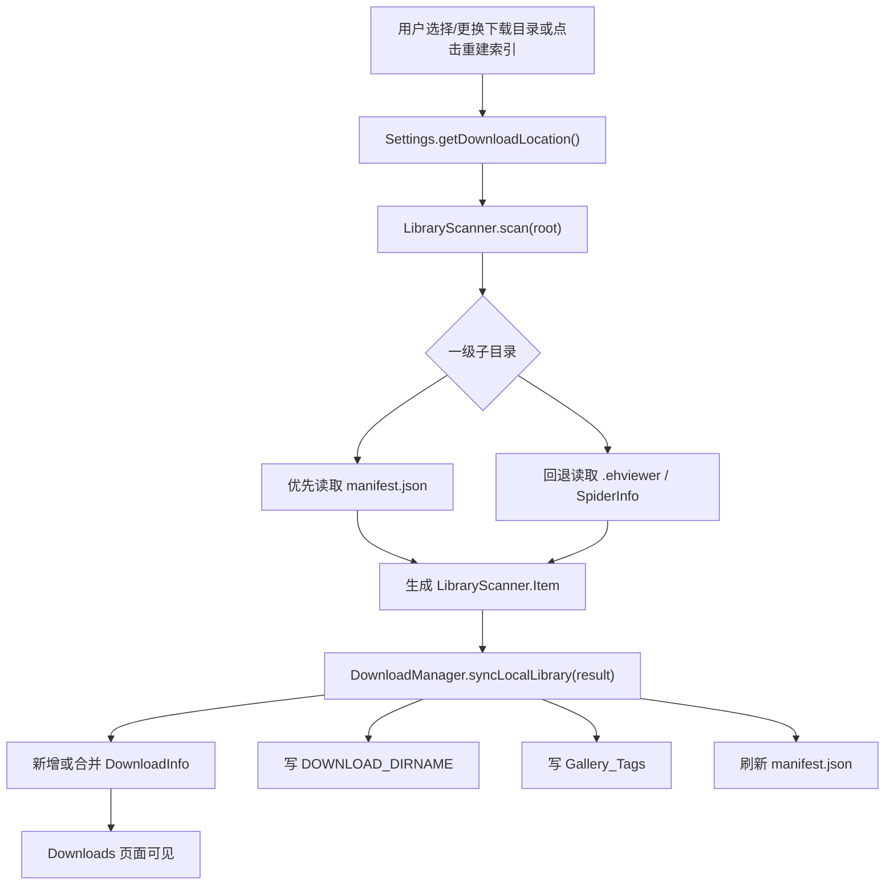

# Ehview 原生 Android 本地库闭环工程审核文档

日期：2026-05-26  
分支：`codex/handoff-native-port`  
目标 PR：`rtwsvj/Ehviewer_CN_SXJ#1`，base `BiLi_PC_Gamer`  
当前主里程碑提交：`74c32b3 Implement local library closed loop`

## 1. 背景与远期目标

本 fork 的技术主线已经从早期 Tauri/Rust 原型收敛到原生 Android。`HANDOFF.md` 只作为产品需求来源，不迁移旧技术栈。

远期产品目标是把当前 EH 在线浏览器扩展成：

- 在线获取：保留现有 EH/ExH 浏览、详情页、下载队列、阅读器能力。
- 本地库优先：用户选择的下载目录成为可信本地库根目录，已下载作品有标准元数据。
- 离线阅读：断网或离线模式下仍可浏览本地库、打开已下载作品；缺页时给出本地不可用提示。
- 可导出：单作品 CBZ、选中作品 CBZ、整库 zip 均包含图片与 `manifest.json`。

第一阶段已经实现“本地库闭环”：下载目录中有 manifest 的作品可被扫描、同步到既有下载数据库、出现在 Downloads 页面，并参与导出。

## 2. 本阶段实施范围

本阶段明确不做以下变化：

- 不更换包名、品牌、图标。
- 不新增数据库 schema，不做迁移。
- 不迁移到 Tauri/Rust 或跨平台框架。
- 不升级 `targetSdkVersion`、主依赖或 UI 主导航结构。
- 不改变现有下载列表作为本地库入口的定位。

已实现范围：

- 标准本地库 manifest 读写。
- 下载根目录一级作品目录扫描。
- `.ehviewer` 旧元数据兼容导入。
- 扫描结果同步到 `DOWNLOADS`、`DOWNLOAD_DIRNAME`、`Gallery_Tags`。
- 下载设置页增加“重建本地库索引”入口。
- 选择/更换下载路径后触发扫描。
- 下载完成、导出前、阅读进度变化后刷新 manifest。
- CBZ/zip 导出包含最新 manifest。
- 本轮模拟器手测发现并修复 scanner 标签重复写入问题。

## 3. 核心代码入口

| 模块 | 文件 | 职责 |
| --- | --- | --- |
| Manifest 标准 | `app/src/main/java/com/hippo/ehviewer/library/LibraryManifest.java` | 读写 `manifest.json`，容忍缺失/损坏字段，记录来源、gallery/download 元数据、阅读信息和文件列表 |
| 本地库扫描 | `app/src/main/java/com/hippo/ehviewer/library/LibraryScanner.java` | 扫描本地库根目录，优先 manifest，回退 `.ehviewer`，计算完成状态，生成待同步项 |
| 下载管理同步 | `app/src/main/java/com/hippo/ehviewer/download/DownloadManager.java` | `syncLocalLibrary()` 合并扫描结果，保留用户标签/时间/活动下载状态，更新数据库和内存列表 |
| 下载设置 UI | `app/src/main/java/com/hippo/ehviewer/ui/fragment/DownloadFragment.java` | 提供重建索引、导出 zip/CBZ 入口，并展示导入结果 toast |
| 导出 | `app/src/main/java/com/hippo/ehviewer/library/LibraryExporter.java` | 导出前刷新 manifest，生成单作品 CBZ、批量 CBZ、整库 zip |
| 单元测试 | `app/src/test/java/com/hippo/ehviewer/library/LibraryManifestTest.java` | manifest roundtrip、缺失/损坏字段兼容 |
| 单元测试 | `app/src/test/java/com/hippo/ehviewer/library/LibraryScannerTest.java` | scanner + DownloadManager 同步、幂等、旧 `.ehviewer` 导入、标签去重 |
| 单元测试 | `app/src/test/java/com/hippo/ehviewer/library/LibraryExporterTest.java` | CBZ/zip 文件名和导出内容基础行为 |

## 4. Manifest 数据模型

文件名固定为作品目录下的 `manifest.json`。当前 schema：

```json
{
  "schema": "ehview.library.manifest.v1",
  "generatedAt": 1770000000000,
  "source": {
    "type": "ehentai",
    "gid": 123456,
    "token": "manualtoken",
    "galleryUrl": "https://e-hentai.org/g/123456/manualtoken/"
  },
  "gallery": {
    "gid": 123456,
    "token": "manualtoken",
    "title": "Manual Local Library Test",
    "titleJpn": "手动本地库测试",
    "uploader": "codex",
    "category": 0,
    "posted": "2026-05-26",
    "pages": 1,
    "simpleLanguage": "EN",
    "simpleTags": ["female:manual"],
    "tgList": ["female:manual", "artist:codex"]
  },
  "download": {
    "state": 3,
    "time": 1770000000000,
    "label": null
  },
  "reading": {
    "startPage": 0,
    "pages": 1,
    "previewPages": 0,
    "previewPerPage": 0
  },
  "files": [
    {
      "name": "00000001.jpg",
      "size": 3,
      "lastModified": 1770000000000
    }
  ]
}
```

兼容策略：

- `LibraryManifest.read(UniFile dir)` 读取失败时返回带 warning 的 record 或 `null`，scanner 不因单个坏目录中断。
- `gallery` 与 `download` 字段都可以作为导入来源；`download` 优先补充下载状态字段。
- `simpleLanguage`、`tgList`、`DownloadInfo` JSON cast 问题已经修复并由测试覆盖。
- manifest 缺字段时尽量使用目录名、图片数量、`.ehviewer` 信息补齐。
- `.ehviewer` 只作为旧目录兼容来源，长期标准是 `manifest.json`。

## 5. 扫描与同步流程



扫描规则：

- 只扫描根目录的一级子目录；非目录文件忽略。
- 每个作品目录优先读取 `manifest.json`，没有 manifest 时尝试读取 `.ehviewer`。
- 作品必须有有效 `gid` 和 `token`；无效目录计入 `failed`。
- 完成状态判定：manifest/download state 为 `STATE_FINISH`，或本地图片数大于等于页数。
- 图片计数使用现有 `GalleryProvider2.SUPPORT_IMAGE_EXTENSIONS`。
- 目录扫描排序稳定，便于重复扫描和测试。

同步规则：

- 新作品：插入 `DownloadInfo`，写入 dirname，写入 tags，加入内存列表。
- 已有作品：合并远端/manifest 元数据，但保留用户手动 label 和 time。
- 正在等待/下载中的作品：保留 `STATE_WAIT` 或 `STATE_DOWNLOAD`，不被扫描结果改成完成或未下载。
- 同步后重新排序列表，并触发现有 `onReload()` / `onUpdateLabels()`。
- 同步后会刷新该作品的 manifest，保证导入后的本地元数据向当前 schema 靠拢。
- 标签写入会对 `tgList` 与 `simpleTags` 的重复项做去重，避免 `female:foo` 被写成 `foo,foo`。

## 6. 存储与安全模型

项目之前的安全热修复已经移除 Android 11+ 的 All Files Access 路径。本地库根目录应依赖：

- SAF 授权目录。
- 应用私有/应用专属外部目录。
- 现有 `UniFile` 抽象。

这意味着 Android 15 模拟器上默认 `/sdcard/EhViewer/download` 可能不可读。手测中该默认路径触发：

```text
Local library index rebuilt. Imported 0, updated 0, skipped 0, failed 1
```

这是预期安全行为，不是 scanner 崩溃。用户应通过设置选择可授权目录；工程侧需要继续验证真实 SAF picker 流程。

## 7. UI 入口

下载设置页新增入口：

- `Rebuild local library index`
- `Export local library zip`
- `Export downloaded galleries as CBZ`

第一版本地库不新增主导航，仍复用 Downloads 页面。用户完成扫描后，导入作品会出现在 Downloads 的默认 label 下，例如本轮手测中的 `Default(1)`。

## 8. 导出行为

`LibraryExporter` 当前行为：

- 单作品 CBZ：压缩图片文件，并包含根部 `manifest.json`。
- 批量 CBZ：对每个已完成下载生成一个 CBZ。
- 整库 zip：以 `galleries/<作品目录>/...` 结构包含作品目录完整内容。
- 导出前都会调用 `LibraryManifest.write()` 刷新 manifest。
- 批量导出复用 `SpiderDen.buildDownloadDirIndex()`，避免对下载根目录重复扫描。

## 9. 模拟器人工测试记录

测试设备：

- AVD：`Codex_Ehview_API35`
- 设备：`emulator-5554`
- Android：15
- ABI：`arm64-v8a`
- 分辨率：1080 x 2400，density 420
- 包名：`com.xjs.ehviewer.debug`

构建与安装：

```bash
rtk rm -rf app/build/intermediates app/build/tmp app/build/generated app/build/kspCaches app/build/outputs/apk/appRelease/debug
rtk env JAVA_HOME=/opt/homebrew/opt/openjdk@21 ANDROID_HOME=/opt/homebrew/share/android-commandlinetools ANDROID_SDK_ROOT=/opt/homebrew/share/android-commandlinetools ./gradlew --no-daemon --max-workers=2 app:assembleDebug --stacktrace
rtk /opt/homebrew/share/android-commandlinetools/platform-tools/adb install -r -d app/build/outputs/apk/appRelease/debug/app-appRelease-debug.apk
```

结果：

- `app:assembleDebug` 成功。
- APK 成功安装到模拟器。
- 安装产物：`app/build/outputs/apk/appRelease/debug/app-appRelease-debug.apk`

手测覆盖：

| 序号 | 场景 | 结果 | 证据 |
| --- | --- | --- | --- |
| 1 | 首次启动内容警告 | 可正常展示并接受 | `artifacts/manual-test-2026-05-26/01-launch.png`、`02-after-accept.png` |
| 2 | 分析/遥测弹窗 | 可选择拒绝，进入登录页 | `03-main-after-analytics-reject.png` |
| 3 | Cookie 登录入口 | 点击后可进入 Cookie 页面，字段包括 `ipb_member_id`、`ipb_pass_hash`、`igneous` | `09-guest-tap-2220.png` |
| 4 | Guest/主列表 | 通过测试偏好绕过首次登录后，主 gallery 列表可展示，无崩溃 | `15-main-via-prefs.png` |
| 5 | 抽屉导航 | 可打开抽屉，Downloads / Settings 等入口可见 | `17-drawer-open.png` |
| 6 | 下载设置页 | 本地库路径、重建索引、zip/CBZ 导出入口可见 | `19-download-settings-top.png`、`20-download-settings-rebuild.png` |
| 7 | 默认路径重建 | Android 15 下默认 `/sdcard/EhViewer/download` 不可读，提示 failed 1 | `21-rebuild-result.png` |
| 8 | 应用专属路径重建 | 设置 app-specific file URI 后导入 1 个作品 | `25-download-settings-after-file-uri.png`、`26-rebuild-success.png` |
| 9 | 重复扫描 | 第二次扫描不重复插入，表现为 imported 0 / updated 1 | `27-rebuild-idempotent.png` |
| 10 | Downloads 列表 | 导入作品出现在 `Default(1)`，标题 `Manual Local Library Test`，状态 `Done` | `31-downloads-list-final.png`、`31-downloads-list-final.xml` |

本地测试样例目录：

```text
/sdcard/Android/data/com.xjs.ehviewer.debug/files/EhViewer/download/123456-manual
  00000001.jpg
  manifest.json
```

数据库核验：

```bash
rtk /opt/homebrew/share/android-commandlinetools/platform-tools/adb exec-out run-as com.xjs.ehviewer.debug cat databases/eh.db > artifacts/manual-test-2026-05-26/eh.db
rtk sqlite3 artifacts/manual-test-2026-05-26/eh.db "select GID,TITLE,STATE,LEGACY,TIME,LABEL,SIMPLE_LANGUAGE from DOWNLOADS where GID=123456;"
rtk sqlite3 artifacts/manual-test-2026-05-26/eh.db "select GID,DIRNAME from DOWNLOAD_DIRNAME where GID=123456;"
rtk sqlite3 artifacts/manual-test-2026-05-26/eh.db "select GID,FEMALE,ARTIST from Gallery_Tags where GID=123456;"
```

实际结果：

```text
123456|Manual Local Library Test|3|0|1770000000000||EN
123456|123456-manual
123456|manual,manual|codex
```

说明：最后一行暴露出本轮手测样例同时在 `simpleTags` 与 `tgList` 放入 `female:manual` 时，旧代码会重复写入 tag。本轮已在 `LibraryScanner` 增加去重，并扩展 `LibraryScannerTest` 覆盖该情况。上述 DB 是修复前手测 APK 的现场证据，工程师复测修复后应看到 `FEMALE=manual`。

崩溃/日志观察：

- 关键 UI 流程后通过 logcat 检查 `FATAL EXCEPTION` / `AndroidRuntime` / `ANR`，未观察到应用崩溃。
- 模拟器有少量系统/GMS 网络 timeout 噪声，与应用流程无关。
- 观察到一次 `HWUI Failed to initialize 101010-2 format`，未导致应用崩溃或功能中断。

## 10. 自动化测试记录

本轮补丁后执行 focused scanner 测试：

```bash
rtk env JAVA_HOME=/opt/homebrew/opt/openjdk@21 ANDROID_HOME=/opt/homebrew/share/android-commandlinetools ANDROID_SDK_ROOT=/opt/homebrew/share/android-commandlinetools ./gradlew --no-daemon --max-workers=2 app:testAppReleaseDebugUnitTest --tests com.hippo.ehviewer.library.LibraryScannerTest --stacktrace
```

结果：

```text
BUILD SUCCESSFUL in 25s
34 actionable tasks: 13 executed, 21 up-to-date
```

工程师复核建议执行完整回归命令：

```bash
rtk env JAVA_HOME=/opt/homebrew/opt/openjdk@21 ANDROID_HOME=/opt/homebrew/share/android-commandlinetools ANDROID_SDK_ROOT=/opt/homebrew/share/android-commandlinetools ./gradlew app:testAppReleaseDebugUnitTest app:lintAppReleaseDebug app:assembleDebug --stacktrace
```

本轮在模拟器手测后追加了 tag 去重补丁，因此本文只把上面的 focused test 作为本轮已验证结果；完整回归建议在工程审核时重新执行并记录。

## 11. 已知限制与风险

1. 真实 SAF picker 目录授权仍需人工复测。本轮为了隔离 scanner/sync 逻辑，在 Android 15 模拟器上使用 app-specific file URI 做了本地库导入验证。
2. Cookie 页面可达，但未填入 Eric 的真实 Cookie，也未验证真实账号重启保持登录。
3. 样例图片是 3 字节占位文件，不适合验证真实阅读器图片解码；本轮验证的是本地库索引和 Downloads 列表闭环。
4. 真实 EH 下载一个完整作品、离线打开已下载作品、导出真实 CBZ/zip 仍建议由工程师用可访问账号补测。
5. 默认 `/sdcard/EhViewer/download` 在 Android 15 不可读是安全策略结果；产品上可能需要更明确的“请选择本地库目录”提示。
6. `LocalLibraryScanTask` 仍使用 `AsyncTask`，符合本轮“最小改动”原则，但长期应迁移到 WorkManager 或生命周期感知任务。
7. manifest schema 当前为 v1，后续字段扩展需要继续保持 tolerant read。

## 12. 工程师审核清单

建议按以下顺序审核：

1. 代码审查 `LibraryManifest`：确认 JSON roundtrip、缺字段容错、损坏 manifest 不影响全局扫描。
2. 代码审查 `LibraryScanner`：确认一级目录扫描、完成状态判定、tag 去重、`.ehviewer` 兼容。
3. 代码审查 `DownloadManager.syncLocalLibrary()`：确认不覆盖用户 label/time，不破坏活动下载状态。
4. 代码审查 `DownloadFragment`：确认设置页入口、scan task 生命周期、toast 计数语义。
5. 代码审查 `LibraryExporter`：确认导出前刷新 manifest，zip/CBZ 结构符合预期。
6. 重新执行完整 Gradle 回归命令。
7. 用真实 SAF 选择目录复测：选择目录、重建索引、重启、再次重建。
8. 用真实下载作品复测：下载完成生成 manifest、离线打开、导出 CBZ、整库 zip。
9. 用损坏 manifest 和缺字段 manifest 复测 scanner 容错。
10. 用 1000+ 本地作品目录评估扫描时间和 UI 阻塞感。

## 13. 后续路线建议

P0：

- 完成真实 SAF picker 手测并优化不可读默认路径提示。
- 用真实图片/真实作品复测阅读器、离线模式和 CBZ/zip 导出。
- 将本轮 focused test 扩展到完整本地库回归 CI job。

P1：

- 将 `LocalLibraryScanTask` 迁移到 WorkManager，支持进度、取消和后台恢复。
- 为 manifest 增加 schema compatibility 测试矩阵。
- 在 Downloads 页面增加轻量状态提示：本地库路径不可读、上次扫描结果、上次扫描时间。

P2：

- 大库扫描增量化：基于目录 mtime / manifest generatedAt 跳过未变化目录。
- 增加导出校验报告：导出作品数、跳过作品数、缺失图片列表。
- 结合性能优化计划继续减少 SAF 重复 I/O。
